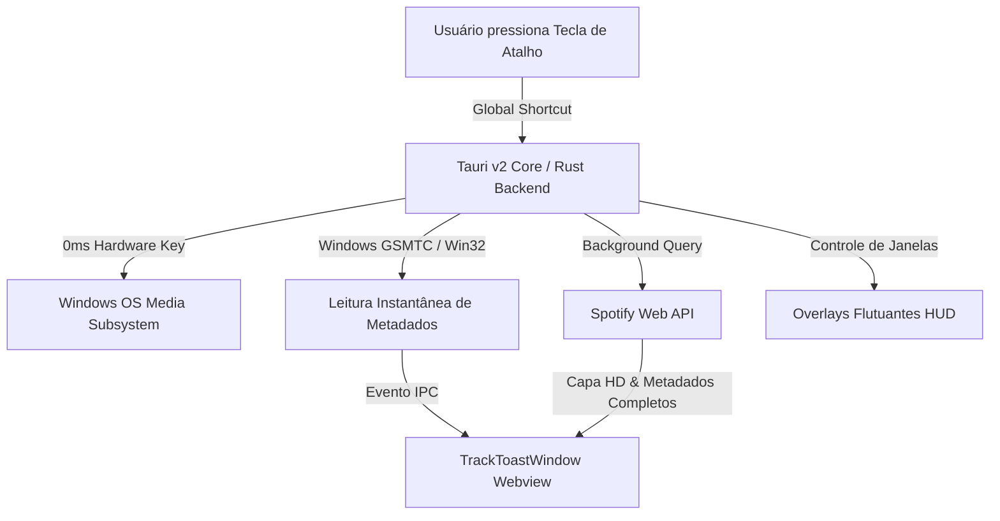

# 🎵 FlowKey — O Companion Definitivo de Atalhos Globais e Overlay para Spotify

> **Controle instantâneo, overlays flutuantes com estética glassmorphism e resposta em tempo real direto no seu teclado.**

---

## 📌 Sumário
1. [Introdução: O Que é o FlowKey?](#-introdução-o-que-é-o-flowkey)
2. [Por Que Criamos o FlowKey? (A Motivação)](#-por-que-criamos-o-flowkey-a-motivação)
3. [Principais Funcionalidades](#-principais-funcionalidades)
4. [Arquitetura e Tecnologias](#-arquitetura-e-tecnologias)
5. [Mergulho Técnico: Como Foi Construído?](#-mergulho-técnico-como-foi-construído)
   - [1. Interceptação Nativa do Windows & Notificações Instantâneas (0ms)](#1-interceptação-nativa-do-windows--notificações-instantâneas-0ms)
   - [2. Autenticação OAuth Loopback de 1 Clique em Rust](#2-autenticação-oauth-loopback-de-1-clique-em-rust)
   - [3. Prevenção de Race Conditions ao Avançar Músicas](#3-prevenção-de-race-conditions-ao-avançar-músicas)
   - [4. Instância Única e Inicialização Silenciosa em Background](#4-instância-única-e-inicialização-silenciosa-em-background)
   - [5. Sistema de Atualizações Automáticas (Tauri v2 Updater)](#5-sistema-de-atualizações-automáticas-tauri-v2-updater)
6. [Galeria de Telas e Demonstrações](#-galeria-de-telas-e-demonstrações)
7. [Como Instalar e Executar](#-como-instalar-e-executar)
8. [Conclusão e Próximos Passos](#-conclusão-e-próximos-passos)

---

## 🌟 Introdução: O Que é o FlowKey?

O **FlowKey** é um aplicativo desktop ultra-leve construído com **Tauri v2**, **Rust** e **React 19**, projetado para transformar a maneira como você interage com o Spotify no Windows.

Em vez de precisar alternar constantemente de janela ou interromper seu foco durante jogos, programação ou trabalho, o FlowKey permite controlar absolutamente tudo por meio de **atalhos de teclado globais personalizáveis** e **overlays flutuantes HUD**.

<!-- Espaço para Imagem de Capa do Projeto -->
> 📸 **[IMAGEM: Banner Principal / Logo do FlowKey]**  
> *(Insira aqui uma imagem de apresentação do FlowKey exibindo o logo e o visual dark do app)*  
> ``

---

## 🎯 Por Que Criamos o FlowKey? (A Motivação)

O aplicativo nativo do Spotify para desktop é excelente para descobrir músicas e gerenciar bibliotecas, mas possui limitações críticas no dia a dia:

1. **Falta de Feedback Visual em Tempo Real**: Ao usar teclas de mídia para pular de faixa, o Windows costuma exibir apenas o indicador nativo genérico ou atrasado, sem enriquecimento instantâneo.
2. **Interrupção de Fluxo**: Para favoritar uma música, pesquisar uma nova playlist, adicionar à fila ou checar a capa do álbum, o usuário é forçado a dar `Alt+Tab` e sair do jogo ou da IDE.
3. **Alto Consumo de Recursos**: Manter navegadores pesados ou janelas de terceiros consome centenas de megabytes de RAM desnecessariamente.

O FlowKey nasceu para resolver exatamente essas dores:
- **Consumo Mínimo de Memória**: O backend em Rust consome apenas ~25MB de RAM.
- **Latência Zero (0ms)**: Resposta imediata utilizando eventos de hardware do Windows.
- **Overlay HUD Elegante**: Janelas flutuantes frameless com efeito glassmorphism que desaparecem automaticamente quando você não precisa delas.

---

## ✨ Principais Funcionalidades

| Recurso | Descrição |
| :--- | :--- |
| ⚡ **Atalhos Globais de Mídia** | Play/Pause, Próxima Faixa, Faixa Anterior e Volume operam globalmente em qualquer app ou jogo. |
| 🔔 **Track Toast Instantâneo (0ms)** | Notificação flutuante que lê os dados via **Windows GSMTC** na velocidade da luz e enriquece com a capa oficial via API. |
| 🪟 **Overlay "Now Playing"** | HUD flutuante translúcido que mostra capa em alta definição, barra de progresso, botões de ação e dados do artista. |
| 🔍 **Overlay de Busca Rápida** | Pressione um atalho e digite para buscar faixas, artistas e álbuns sem sair da sua tela atual. |
| ❤️ **Like / Dislike com 1 Toque** | Salve ou remova faixas das "Músicas Curtidas" instantaneamente sem abrir o Spotify. |
| 📋 **Menu de Playlists e Fila** | Adicione faixas a playlists existentes ou envie para a fila de reprodução com 1 comando. |
| 🔒 **Single-Instance Lock** | Impede múltiplas instâncias concorrentes; abrir o app novamente apenas foca a instância ativa. |
| 🚀 **Inicialização Silenciosa** | Inicia junto com o Windows direto na **Bandeja do Sistema (System Tray)** sem incomodar o usuário. |
| 🔄 **Auto-Updater Embutido** | Verifica, baixa e instala atualizações diretamente pelo GitHub Releases com verificação de assinatura criptográfica. |

---

## 🏗️ Arquitetura e Tecnologias

O FlowKey adota uma arquitetura híbrida moderna e de altíssimo desempenho:



### Stack Utilizada:
- **Backend**: Rust 2021 + Tauri v2.x (Plugins: `single-instance`, `autostart`, `updater`, `global-shortcut`, `opener`).
- **Windows APIs**: Crate `windows` (GSMTC `GlobalSystemMediaTransportControlsSessionManager`) + `windows-sys` (`keybd_event`, Win32 messaging).
- **Frontend**: React 19, TypeScript, Tailwind CSS v4, Lucide Icons, Shadcn UI / Radix primitives.
- **Tooling & Build**: Bun (JavaScript Runtime & Package Manager) + Vite 7 + Cargo.

---

## 🛠️ Mergulho Técnico: Como Foi Construído?

Abaixo detalhamos as soluções de engenharia implementadas no projeto.

---

### 1. Interceptação Nativa do Windows & Notificações Instantâneas (0ms)

Para eliminar o atraso de sincronização da nuvem, o FlowKey consulta diretamente o subsistema **GSMTC (Global System Media Transport Controls)** do Windows em Rust. Quando você pula uma faixa, o Windows já sabe o nome da nova música milissegundos antes do Spotify enviar os dados para seus servidores web.

```rust
#[cfg(target_os = "windows")]
fn get_windows_media_properties() -> Result<NativeMediaMetadata, String> {
    use windows::Media::Control::GlobalSystemMediaTransportControlsSessionManager;

    let manager = GlobalSystemMediaTransportControlsSessionManager::RequestAsync()?
        .get()?;

    let session = manager.GetCurrentSession()?;
    let properties = session.TryGetMediaPropertiesAsync()?.get()?;

    let title = properties.Title().map(|h| h.to_string()).unwrap_or_default();
    let artist = properties.Artist().map(|h| h.to_string()).unwrap_or_default();
    let album = properties.AlbumTitle().map(|h| h.to_string()).unwrap_or_default();

    // Extrai o thumbnail do stream nativo caso disponível
    let mut album_art = String::new();
    if let Ok(thumb_ref) = properties.Thumbnail() {
        if let Ok(stream_op) = thumb_ref.OpenReadAsync() {
            if let Ok(stream) = stream_op.get() {
                if let Ok(size) = stream.Size() {
                    if size > 0 && size < 4 * 1024 * 1024 {
                        use windows::Storage::Streams::{DataReader, InputStreamOptions};
                        if let Ok(reader) = DataReader::CreateDataReader(&stream) {
                            let _ = reader.SetInputStreamOptions(InputStreamOptions::None);
                            if let Ok(load_op) = reader.LoadAsync(size as u32) {
                                if load_op.get().is_ok() {
                                    let mut bytes = vec![0u8; size as usize];
                                    if reader.ReadBytes(&mut bytes).is_ok() {
                                        album_art = format!("data:image/png;base64,{}", BASE64_STANDARD.encode(&bytes));
                                    }
                                }
                            }
                        }
                    }
                }
            }
        }
    }

    Ok(NativeMediaMetadata { title, artist, album, album_art })
}
```

---

### 2. Autenticação OAuth Loopback de 1 Clique em Rust

Adeus à necessidade de colar URLs ou tokens manualmente. O FlowKey sobe um mini servidor HTTP temporário na porta local `8888`, abre o navegador padrão via `tauri-plugin-opener` e aguarda o redirecionamento oficial do Spotify:

```rust
#[command]
async fn start_spotify_oauth_listener(app: AppHandle, port: u16) -> Result<(), String> {
    tokio::spawn(async move {
        let listener = match TcpListener::bind(format!("127.0.0.1:{}", port)).await {
            Ok(l) => l,
            Err(e) => return,
        };

        if let Ok((mut stream, _)) = listener.accept().await {
            let mut buffer = [0u8; 4096];
            if let Ok(n) = stream.read(&mut buffer).await {
                let request = String::from_utf8_lossy(&buffer[..n]);
                if let Some(code) = extract_auth_code(&request) {
                    let _ = app.emit("spotify_auth_code_received", code);
                    
                    let response = "HTTP/1.1 200 OK\r\nContent-Type: text/html; charset=utf-8\r\n\r\n<!DOCTYPE html><html><body style='background:#0f1115;color:#1ed760;text-align:center;padding:50px;font-family:sans-serif;'><h2>Conectado com sucesso ao FlowKey!</h2><p>Você pode fechar esta aba agora.</p><script>setTimeout(window.close, 1500);</script></body></html>";
                    let _ = stream.write_all(response.as_bytes()).await;
                }
            }
        }
    });
    Ok(())
}
```

---

### 3. Prevenção de Race Conditions ao Avançar Músicas

Quando o usuário pressiona "Avançar Faixa" várias vezes rapidamente, as requisições assíncronas poderiam retornar fora de ordem e exibir uma música já descartada. O FlowKey resolve isso através de um **contador de sequência (`skipSequence`)** e comparação do ID anterior:

```typescript
let skipSequence = 0;

const handleNextTrack = async () => {
  const seq = ++skipSequence;
  const previousTrackId = spotifyService.getLastTrackId();

  try {
    // 1. Dispara o hardware key de forma nativa
    await invoke("native_next_track");

    // 2. Consulta imediatamente os metadados do Windows (0ms)
    setTimeout(async () => {
      if (seq !== skipSequence) return;
      const nativeInfo = await getNativeMediaInfo();
      if (nativeInfo?.title) {
        await invoke("show_track_toast", {
          payload: {
            action: "next",
            title: nativeInfo.title,
            artist: nativeInfo.artist || "Spotify Playback",
            album_art: nativeInfo.album_art || "",
          },
        });
      }
    }, 60);

    // 3. Em paralelo, faz polling inteligente na API até receber um ID DIFERENTE do anterior
    if (spotifyService.isAuthenticated()) {
      const newItem = await spotifyService.fetchNewTrackAfterSkip(previousTrackId);
      if (seq === skipSequence && newItem) {
        await invoke("show_track_toast", {
          payload: {
            action: "next",
            title: newItem.name,
            artist: newItem.artists?.map((a) => a.name).join(", ") || "",
            album_art: newItem.album?.images?.[0]?.url || "",
          },
        });
      }
    }
  } catch (e) {
    console.error("Erro ao avançar faixa:", e);
  }
};
```

---

### 4. Instância Única e Inicialização Silenciosa em Background

Para que o aplicativo inicie com o sistema de forma invisível (apenas na bandeja), configuramos a janela principal com `"visible": false` no `tauri.conf.json` e avaliamos os argumentos de inicialização e o tempo de boot do Windows:

```rust
.plugin(tauri_plugin_single_instance::init(|app, _args, _cwd| {
    // Se o usuário clicar no ícone do app enquanto ele já estiver rodando, foca a janela existente
    if let Some(window) = app.get_webview_window("main") {
        let _ = window.show();
        let _ = window.unminimize();
        let _ = window.set_focus();
    }
}))
.plugin(tauri_plugin_autostart::init(
    tauri_plugin_autostart::MacosLauncher::LaunchAgent,
    Some(vec!["--autostart"]),
))
.setup(|app| {
    use tauri_plugin_autostart::ManagerExt;

    let is_autostart_arg = std::env::args().any(|arg| {
        let a = arg.to_lowercase();
        a == "--autostart" || a == "--silent" || a == "--minimized" || a.contains("autostart")
    });

    let is_recent_boot = sysinfo::System::uptime() < 120;
    let autolaunch = app.autolaunch();
    let autolaunch_enabled = autolaunch.is_enabled().unwrap_or(false);

    // Garante que o registro do Windows sempre esteja sincronizado com a flag --autostart
    if autolaunch_enabled {
        let _ = autolaunch.disable();
        let _ = autolaunch.enable();
    }

    let is_autostart = is_autostart_arg || (is_recent_boot && autolaunch_enabled);

    // Se NÃO for inicialização automática do Windows, exibe a janela principal
    if !is_autostart {
        if let Some(window) = app.get_webview_window("main") {
            let _ = window.show();
            let _ = window.unminimize();
            let _ = window.set_focus();
        }
    }

    Ok(())
})
```

---

### 5. Sistema de Atualizações Automáticas (Tauri v2 Updater)

O FlowKey possui um pipeline de CI/CD automatizado no **GitHub Actions**. A cada nova tag (`v1.x.x`), o fluxo compila o executável, assina digitalmente os artefatos com `minisign` e gera o `latest.json`.

No cliente, o frontend consome a API do updater e notifica o usuário com badges animados:

```typescript
export async function checkForUpdates(): Promise<UpdateInfo> {
  const update = await check();
  if (update) {
    return {
      available: true,
      version: update.version,
      currentVersion: update.currentVersion,
      body: update.body,
      date: update.date,
    };
  }
  return { available: false };
}
```

---

## 📸 Galeria de Telas e Demonstrações

Aqui você pode conferir as principais interfaces do FlowKey em ação:

### 1. Painel Principal de Configurações
Gerencie todos os atalhos, defina aliases rápidos e conecte sua conta do Spotify.

> 📸 **[IMAGEM: Janela Principal de Configurações do FlowKey]**  
> *(Insira aqui a captura de tela da tela principal `MainSettingsView`)*  
> ``

---

### 2. Overlay Flutuante "Now Playing" (HUD)
Aparece no centro da tela com comandos de reprodução, barra de progresso em tempo real e visualização de álbum sem bordas.

> 📸 **[IMAGEM: Overlay Now Playing]**  
> *(Insira aqui a captura de tela do HUD translúcido `NowPlayingOverlayWindow`)*  
> ``

---

### 3. Overlay de Busca Rápida
Busca instantânea no catálogo do Spotify para reproduzir músicas ou rádios de artista rapidamente.

> 📸 **[IMAGEM: Overlay de Busca Rápida]**  
> *(Insira aqui a captura de tela do `SearchOverlayView`)*  
> ``

---

### 4. Notificação Flutuante de Faixa (Track Toast)
Notificação leve e discreta que surge no canto da tela informando a nova faixa com latência zero.

> 📸 **[IMAGEM: Track Toast Notification]**  
> *(Insira aqui a captura de tela do `TrackToastWindow`)*  
> ``

---

### 5. Modal de Configurações & Bandeja do Sistema
Gerencie o início com o Windows, verifique atualizações e acesse o menu de contexto na bandeja.

> 📸 **[IMAGEM: Modal de Configurações & System Tray]**  
> *(Insira aqui a captura de tela do `SettingsModal` e do menu de bandeja)*  
> ``

---

## 💻 Como Instalar e Executar

### Pré-requisitos
- [Rust](https://www.rust-lang.org/) (versão estável mais recente)
- [Bun](https://bun.sh/) ou Node.js (v18+)
- [Spotify Desktop](https://www.spotify.com/) instalado no Windows

### Clonando e Rodando em Modo de Desenvolvimento

```bash
# 1. Clone o repositório
git clone https://github.com/GabrielSantos23/flowkey.git
cd flowkey

# 2. Instale as dependências do Frontend com Bun
bun install

# 3. Inicie o ambiente de desenvolvimento do Tauri
bun run tauri dev
```

### Compilando o Instalador de Produção

```bash
bun run tauri build
```
Os arquivos `.msi` e `.exe` instaláveis serão gerados em `src-tauri/target/release/bundle/`.

---

## 🚀 Conclusão e Próximos Passos

O **FlowKey** demonstra o poder da combinação entre **Rust** e **Tauri v2** para criar utilitários de sistema operacional que são simultaneamente ultrarrápidos, visualmente impressionantes e extremamente econômicos em memória.

### O Que Vem a Seguir:
- [ ] Suporte a temas personalizados (Custom Accent Colors).
- [ ] Visualizador de letras sincronizadas (Lyrics Overlay).
- [ ] Suporte multi-plataforma para macOS e Linux.

---

⭐ **Gostou do projeto?** Deixe uma estrela no [Repositório Oficial do FlowKey no GitHub](https://github.com/GabrielSantos23/flowkey)!
